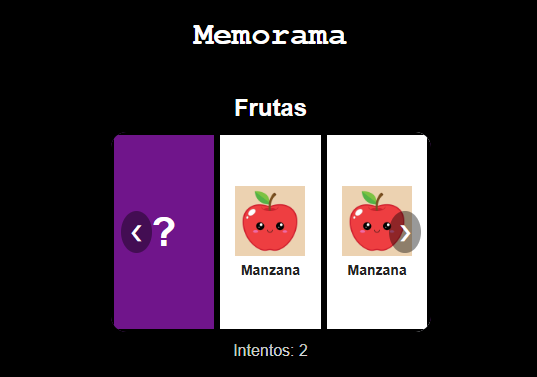
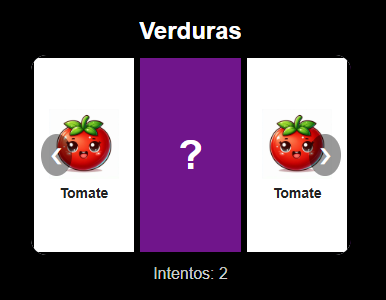
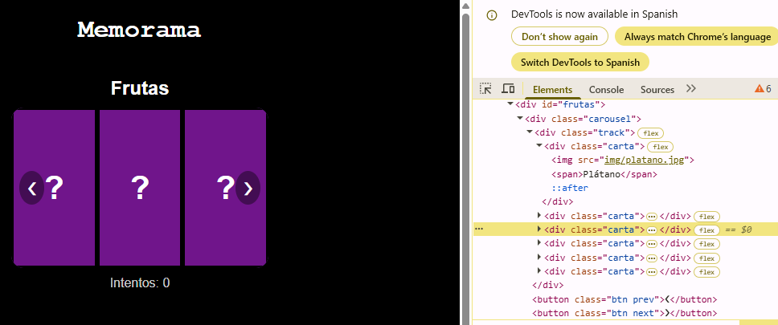
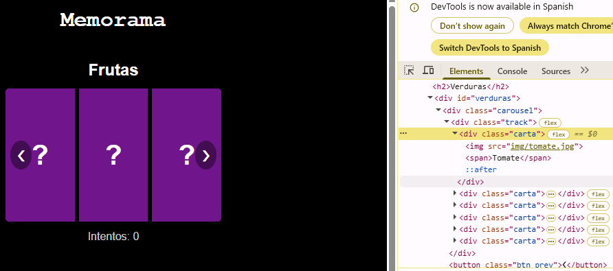

<h1 align="center">🃏 Memorama Carrusel JS</h1>

<p align="center">
  Componente visual reutilizable hecho con JavaScript, HTML y CSS puros.<br>
  <b>Actividad 3. Componente Visual con JS</b>
</p>

<p align="center">
  <a href="https://ingridthv.github.io/Actividad3-Componente-Visual-JS/"><b>Página</b></a>
</p>

## Autora

Ingrid Arcadio Aparicio

---

## ¿Qué problema resuelve?

Hacer un memorama en una página normalmente significa escribir a mano el HTML de cada carta, repetir cada una para formar los pares, revolverlas y programar la lógica de voltear y comparar. Si quieres otro memorama con distintas imágenes, tienes que repetir todo.

**Memorama Carrusel JS** lo resuelve con una sola función: le pasas *dónde* quieres el juego y *qué* imágenes quieres usar, y él crea las cartas, forma los pares, las revuelve y maneja el juego. Además, las cartas están en un **carrusel**: solo se ven 3 a la vez y con las flechas te mueves entre ellas, así que tienes que recordar dónde quedó cada una.

## Características

- Genera todo el HTML dinámicamente con JavaScript.
- Duplica los elementos para formar los pares y los revuelve al azar.
- Las cartas se navegan con flechas ❮ ❯ (se ven 3 a la vez).
- Al hacer clic, la carta se voltea y muestra su imagen y su texto.
- Si las dos cartas son iguales se quedan descubiertas; si no, se voltean de nuevo.
- Contador de intentos y mensaje al ganar.
- Reutilizable: puedes tener varios memoramas en la misma página, cada uno independiente.
- Sin frameworks ni dependencias.

## Instalación

Copia a tu proyecto `css/styles.css`, `js/memorama.js` y la carpeta `img/` con tus imágenes, e inclúyelos en tu HTML:

```html
<head>
    <link rel="stylesheet" href="css/styles.css" />
</head>
<body>
    <!-- tu contenido -->

    <script src="js/memorama.js"></script>
    <script src="js/fruyver.js"></script>
</body>
```

> `memorama.js` debe ir **antes** que el archivo donde lo usas (`fruyver.js`), porque este último llama a la función.

## Uso

**1. Crea un contenedor vacío en tu HTML:**

```html
<section>
    <h2>Frutas</h2>
    <div id="frutas"></div>
</section>
```

**2. En tu archivo JS, crea el memorama indicando el contenedor y las imágenes:**

```js
crearMemorama("#frutas", [
    { texto: "Uva", imagen: "img/uvav.jpg" },
    { texto: "Manzana", imagen: "img/manzana.jpg" },
    { texto: "Plátano", imagen: "img/platano.jpg" }
]);
```

Con 3 elementos se generan 6 cartas (3 pares).

**3. ¿Otro memorama con distinto contenido? Llama a la misma función de nuevo:**

```js
crearMemorama("#frutas", [
    { texto: "Uva", imagen: "img/uvav.jpg" },
    { texto: "Manzana", imagen: "img/manzana.jpg" },
    { texto: "Plátano", imagen: "img/platano.jpg" }
]);

crearMemorama("#verduras", [
    { texto: "Brócoli", imagen: "img/brocoli.jpg" },
    { texto: "Tomate", imagen: "img/tomate.jpg" },
    { texto: "Pimiento", imagen: "img/pimiento.jpg" }
]);
```

### Parámetros

| Parámetro | Tipo   | Descripción                                                        |
|-----------|--------|--------------------------------------------------------------------|
| `id`      | String | Selector del contenedor donde se dibuja el juego (ej. `"#frutas"`) |
| `items`   | Array  | Lista de objetos. Cada uno genera un **par** de cartas             |

Cada objeto de `items` tiene:

| Propiedad | Tipo   | Descripción                                                |
|-----------|--------|------------------------------------------------------------|
| `texto`   | String | Nombre de la carta (también sirve para comparar los pares) |
| `imagen`  | String | Ruta de la imagen (ej. `"img/uvav.jpg"`)                   |

### Código de la librería (`js/memorama.js`)

```js
function crearMemorama(id, items) {

    const contenedor = document.querySelector(id);

    let index = 0;
    let primera = null;
    let bloqueo = false;
    let intentos = 0;
    let pares = 0;

    const cartas = items.concat(items);
    cartas.sort(function () {
        return Math.random() - 0.5;
    });

    let html = "";
    for (let i = 0; i < cartas.length; i++) {
        html = html + '<div class="carta">' +
                          '' +
                          '<span>' + cartas[i].texto + '</span>' +
                      '</div>';
    }

    contenedor.innerHTML =
        '<div class="carousel">' +
            '<div class="track">' + html + '</div>' +
            '<button class="btn prev">&#10094;</button>' +
            '<button class="btn next">&#10095;</button>' +
        '</div>' +
        '<p class="info">Intentos: 0</p>';

    const track = contenedor.querySelector(".track");
    const nextBtn = contenedor.querySelector(".next");
    const prevBtn = contenedor.querySelector(".prev");
    const info = contenedor.querySelector(".info");
    const todas = contenedor.querySelectorAll(".carta");

    function actualizar() {
        track.style.transform = "translateX(-" + index * (100 / 3) + "%)";
    }

    nextBtn.addEventListener("click", function () {
        index++;
        if (index > cartas.length - 3) index = 0;
        actualizar();
    });

    prevBtn.addEventListener("click", function () {
        index--;
        if (index < 0) index = cartas.length - 3;
        actualizar();
    });

    for (let i = 0; i < todas.length; i++) {
        todas[i].addEventListener("click", function () {

            if (bloqueo) return;
            if (todas[i].classList.contains("volteada")) return;

            todas[i].classList.add("volteada");

            if (primera === null) {
                primera = i;
                return;
            }

            intentos++;
            info.textContent = "Intentos: " + intentos;

            if (cartas[primera].texto === cartas[i].texto) {
                pares++;
                primera = null;
                if (pares === items.length) {
                    info.textContent = "¡Ganaste en " + intentos + " intentos!";
                }
            } else {
                bloqueo = true;
                const anterior = primera;
                primera = null;
                setTimeout(function () {
                    todas[anterior].classList.remove("volteada");
                    todas[i].classList.remove("volteada");
                    bloqueo = false;
                }, 1000);
            }
        });
    }
}
```

## Estructura del proyecto

```
Actividad3-Componente-Visual-JS/
├── css/
│   └── styles.css     
├── js/
│   ├── memorama.js     
│   └── fruyver.js      
├── img/                
├── index.html          
└── README.md
```

## Notas

- No requiere instalación ni compilación: basta con abrir `index.html` en el navegador.
- Para un memorama más grande, agrega más elementos a la lista; el componente crea los pares solo.
- Para cambiar el tamaño de las imágenes, ajusta `height` en la regla `.carta img` de `styles.css`.


## Capturas de pantalla

### Memorama de frutas


### Memorama de verduras


### HTML generado dinámicamente (herramientas de desarrollador)





## Video demo


